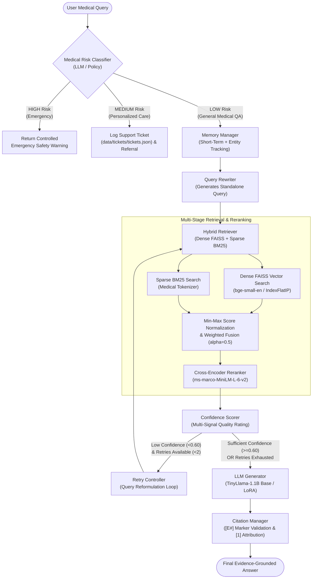

# MedAssistRAG

> **Evidence-Grounded Medical Question Answering with Hybrid Retrieval, Reranking, Memory, Safety, Confidence-Based Retry, and LoRA Fine-Tuned LLM Generation**


---

## 📋 Table of Contents
1. [Overview](#overview)
2. [Key Features](#key-features)
3. [System Architecture](#system-architecture)
4. [Project Structure](#project-structure)
5. [Core Subsystem Deep Dive](#core-subsystem-deep-dive)
6. [Configuration System](#configuration-system)
7. [Installation & Setup](#installation--setup)
8. [Usage & Execution](#usage--execution)
9. [LLM LoRA Fine-Tuning Pipeline](#llm-lora-fine-tuning-pipeline)
10. [Evaluation & Benchmarks](#evaluation--benchmarks)
11. [Testing](#testing)

---

## 🔬 Overview

**MedAssistRAG** is an enterprise-ready Retrieval-Augmented Generation (RAG) framework designed specifically for safe, hallucination-resistant, and evidence-grounded medical question answering. 

### The Problem in Medical QA
Standard Large Language Models (LLMs) suffer from two critical vulnerabilities when applied to healthcare:
1. **Hallucinations & Factual Errors**: Generating plausible-sounding but clinically false medical advice.
2. **Lack of Verifiable Sources**: Providing responses without traceable evidence or medical citations.

### The MedAssistRAG Solution
MedAssistRAG addresses these challenges by combining a **Multi-Stage Hybrid Retrieval** architecture with **Programmatic Confidence Scoring**, **Bounded Self-Correction Retry Loops**, **Multi-Turn Memory**, **Medical Risk Safety Protocols**, and **Verifiable Evidence Citation Attribution**.

- **Hybrid Retrieval (Dense + Sparse)**: Combines dense semantic vector search (`BAAI/bge-small-en` via FAISS `IndexFlatIP`) with sparse keyword matching (`rank-bm25` with medical-aware tokenization) to maximize recall for both clinical descriptions and exact medical terminology (e.g., drug names, codes, conditions).
- **Base Cross-Encoder Reranking**: Re-evaluates top retrieved candidates using a pretrained Cross-Encoder (`ms-marco-MiniLM-L-6-v2`) to prioritize true semantic relevance before context assembly.
- **Programmatic Confidence Scoring**: Computes a multi-signal quality score ($[0.0, 1.0]$) based on rank decay and reranker relevance to detect weak retrieval.
- **Bounded Self-Correction Retry Loop**: Automatically rewrites and retries weak queries (confidence $< 0.60$) up to 2 times, abstaining gracefully if information remains insufficient.
- **Conversational Memory**: Tracks sliding-window turn history (Short-Term Memory) and extracted clinical entities (Entity Memory) to contextualize follow-up questions.
- **Medical Risk Classification & Escalation**: Classifies queries into `LOW`, `MEDIUM`, or `HIGH` risk before retrieval. Emergency queries (`HIGH`) return controlled safety warnings, while personalized care requests (`MEDIUM`) register support tickets (`data/tickets/tickets.json`).
- **Verifiable Source Attribution**: Converts raw LLM evidence markers (`[E#]`) into verified, numbered citations (`[1]`) mapped directly to retrieved corpus passages.
- **Causal LLM LoRA Fine-Tuning**: Integrates Parameter-Efficient Fine-Tuning (PEFT/LoRA) on `TinyLlama-1.1B` to enforce strict evidence-bounded answer generation.

---

## ✨ Key Features

| Subsystem | Feature | Technical Implementation |
|---|---|---|
| **Dense Search** | FAISS Vector Indexing | `BAAI/bge-small-en` embeddings, L2 normalization, `IndexFlatIP` cosine similarity |
| **Sparse Search** | BM25 Keyword Search | `rank-bm25` with medical regex tokenization (captures terms like `SARS-CoV-2`, `HbA1c`) |
| **Hybrid Fusion** | Min-Max Normalization | Score normalization + weighted score fusion ($\alpha = 0.5$) |
| **Reranker** | Cross-Encoder Reranking | Pretrained `cross-encoder/ms-marco-MiniLM-L-6-v2` candidate reranking |
| **Confidence Scorer** | Multi-Signal Quality Score | Weighted retrieval + reranker score fusion with exponential rank decay |
| **Self-Correction** | Bounded Retry Controller | Max 2 retries on low confidence (< 0.60) with LLM query rewriting |
| **Conversation Memory** | Dual-Tier Memory | Short-Term Sliding Window (max 10 turns) + Entity Tracking Memory |
| **Query Rewriter** | Standalone Query Conversion | Generates context-independent standalone queries for multi-turn conversations |
| **Safety Protocol** | Medical Risk Classifier | LLM-based risk classifier (`LOW`, `MEDIUM`, `HIGH`) & `TicketManager` logging |
| **Citations** | Verifiable Evidence Attribution | Maps raw `[E#]` markers to validated numbered sources `[1]` |
| **Generator** | Fine-Tuned Causal LLM | `TinyLlama-1.1B-Chat` base model + PEFT LoRA adapter execution |

---

## 🏗️ System Architecture



---

## 📁 Project Structure

```text
MedAssistRAG/
│
├── configs/                              # System Configuration YAML Files
│   ├── citations.yaml                    # Evidence max chunks & citation rules
│   ├── confidence.yaml                   # Retrieval/reranker weights & confidence thresholds
│   ├── memory.yaml                       # Short-term window limits & entity memory settings
│   ├── retrieval.yaml                    # FAISS + BM25 hybrid retrieval & reranker settings
│   ├── retry.yaml                        # Bounded self-correction retry loop parameters
│   └── safety.yaml                       # Risk levels (LOW, MEDIUM, HIGH) & safety policies
│
├── data/                                 # Embeddings, Indexes & Support Tickets
│   ├── embeddings/
│   │   ├── bm25_index.pkl                # Serialized BM25 index
│   │   ├── faiss_index.bin               # FAISS vector database index (IndexFlatIP)
│   │   └── texts.pkl                     # Serialized corpus passages
│   ├── processed/
│   │   └── .gitkeep                      # Preserved directory for future processed datasets
│   ├── raw/
│   │   └── .gitkeep                      # Preserved directory for future raw datasets
│   └── tickets/
│       └── tickets.json                  # Support escalation tickets logged by TicketManager
│
├── docs/                                 # Technical Architecture & Guides
│   └── ARCHITECTURE_AND_INTERVIEW_GUIDE.md # Comprehensive system guide & technical documentation
│
├── evaluation/                           # Benchmark Evaluation Suite & Reports
│   ├── plots/                            # Exported evaluation comparison charts (PNGs)
│   ├── reports/                          # Metric summary CSV reports
│   └── scripts/
│       ├── advanced_metrics.py           # F1, Exact Match, BLEU, Semantic & Grounding metrics
│       ├── compare_models.py             # Model comparison benchmarking script
│       ├── eval_retrieval.py             # Retrieval benchmark evaluation script
│       └── final_evaluate.py             # End-to-end pipeline benchmark runner
│
├── models/                               # Model Weights Directory
│   └── generator/
│       └── lora/
│           └── .gitkeep                  # Preserved placeholder for PEFT LoRA adapter
│
├── src/                                  # Core Application Production Package
│   ├── __init__.py
│   ├── config.py                         # Single Canonical System Configuration Module
│   ├── citations/                        # Citation Attribution Layer
│   │   ├── __init__.py
│   │   ├── citation_manager.py           # Evidence tagging [E#] -> [1] conversion & validation
│   │   └── models.py                     # Citation & Evidence Pydantic data models
│   ├── confidence/                       # Confidence Scoring Layer
│   │   ├── __init__.py
│   │   ├── scorer.py                     # Weighted retrieval + reranker confidence calculation
│   │   └── thresholds.py                 # HIGH, MEDIUM, LOW threshold definitions
│   ├── data_utils/                       # Dataset Utilities
│   │   ├── __init__.py
│   │   ├── chunk_data.py                 # Text chunking functions
│   │   ├── load_data.py                  # CSV data loading functions
│   │   └── prepare_data.py               # PubMedQA / MedQuAD / MedMCQA dataset merger
│   ├── generator/                        # LLM Generator Layer
│   │   ├── __init__.py
│   │   └── llm.py                        # TinyLlama-1.1B interface & LoRA adapter loader
│   ├── memory/                           # Conversation Memory Management
│   │   ├── __init__.py
│   │   ├── entity_memory.py              # Medical entity tracking (conditions, medications, etc.)
│   │   ├── memory_manager.py             # Memory orchestrator facade
│   │   ├── models.py                     # Memory context data structures
│   │   └── short_term_memory.py          # Sliding window message history (max 10 messages)
│   ├── pipeline/                         # Pipeline Orchestration Layer
│   │   ├── __init__.py
│   │   └── rag_pipeline.py               # End-to-End Memory-Aware RAG Pipeline orchestrator
│   ├── query/                            # Query Processing
│   │   ├── __init__.py
│   │   └── query_rewriter.py             # LLM standalone query rewriter
│   ├── reranker/                         # Reranking Layer
│   │   ├── __init__.py
│   │   └── reranker.py                   # Cross-Encoder candidate reranker (ms-marco-MiniLM-L-6-v2)
│   ├── retriever/                        # Retrieval Layer
│   │   ├── __init__.py
│   │   ├── bm25_retriever.py             # Unified BM25 keyword search & index builder
│   │   ├── dense_retriever.py            # Unified FAISS IndexFlatIP cosine search & embeddings
│   │   ├── hybrid_retriever.py           # Min-Max score normalization & dense+sparse fusion
│   │   ├── run_pipeline.py               # End-to-end dataset embedding & index builder script
│   │   └── search.py                     # Retriever facade class
│   ├── retry/                            # Self-Correction Retry Layer
│   │   ├── __init__.py
│   │   └── retry_controller.py           # Bounded query retry loop & abstention logic
│   ├── safety/                           # Medical Safety & Risk Escalation Layer
│   │   ├── __init__.py
│   │   ├── risk_classifier.py            # LLM-based risk classifier (LOW, MEDIUM, HIGH)
│   │   ├── safety_policy.py              # Safety policies & response generator
│   │   └── ticket_manager.py             # Support ticket generator & JSON logger
│   └── training/                         # Single Canonical LLM LoRA Fine-Tuning Pipeline
│       ├── prepare_finetune_data.py      # Context retrieval for fine-tuning pairs
│       ├── tokenize_data.py              # Dataset tokenization script
│       └── train_lora.py                 # PEFT LoRA trainer script for causal LLMs
│
├── tests/                                # Automated Pytest Unit Test Suite (71 Tests)
│   ├── test_citation_manager.py          # Pytest unit tests for CitationManager
│   ├── test_confidence_scorer.py         # Pytest unit tests for ConfidenceScorer
│   ├── test_hybrid_retrieval.py          # Pytest unit tests for FAISS, BM25 & Hybrid Retriever
│   ├── test_llm.py                       # Pytest unit tests for LLM generator
│   ├── test_memory_manager.py            # Pytest unit tests for MemoryManager
│   ├── test_retry_controller.py          # Pytest unit tests for RetryController
│   └── test_risk_classifier.py           # Pytest unit tests for RiskClassifier
│
├── .gitignore                            # Git ignore rules for GitHub
├── main.py                               # Primary Interactive CLI Entry Point
├── pytest.ini                            # Pytest configuration (pythonpath = .)
├── README.md                             # Project Overview & System Documentation
└── requirements.txt                      # Python Package Dependencies
```

---

## 🧩 Core Subsystem Deep Dive

### 1. Hybrid Retrieval & Reranking (`src/retriever/`, `src/reranker/`)
- **Dense Retriever (`dense_retriever.py`)**: Uses `BAAI/bge-small-en` to project texts into 384-dimensional dense vectors. Embeddings are L2-normalized and indexed in FAISS `IndexFlatIP`. Because vectors are normalized to unit length, inner product search mathematically equals **cosine similarity** ($\cos(\theta) \in [-1.0, 1.0]$).
- **Sparse Retriever (`bm25_retriever.py`)**: Implements `BM25Okapi` with a specialized medical regex tokenizer (`[a-zA-Z0-9]+(?:-[a-zA-Z0-9]+)*`) to handle medical terms, compound codes, and drug names.
- **Score Normalization & Fusion (`hybrid_retriever.py`)**: Applies Min-Max score normalization independently across Dense and BM25 candidate pools before fusing scores via alpha weighting:
  $$\text{Score}_{\text{Hybrid}} = \alpha \cdot \text{Score}_{\text{Dense}} + (1 - \alpha) \cdot \text{Score}_{\text{BM25}} \quad (\alpha = 0.5)$$
- **Cross-Encoder Reranking (`reranker.py`)**: Uses base pretrained `cross-encoder/ms-marco-MiniLM-L-6-v2` to compute full cross-attention relevance scores across top candidates, re-ordering the top 5 passages.

### 2. Programmatic Confidence Scoring (`src/confidence/`)
Rather than relying on LLM self-assessment (which is prone to overconfidence), MedAssistRAG calculates a deterministic confidence score ($C \in [0.0, 1.0]$) fusing retrieval fusion scores and reranker output with exponential rank decay:
- `HIGH` Confidence ($C \ge 0.80$): Direct generation.
- `MEDIUM` Confidence ($0.60 \le C < 0.80$): Direct generation with disclaimer.
- `LOW` Confidence ($C < 0.60$): Triggers self-correction retry loop or abstention.

### 3. Bounded Self-Correction Retry Loop (`src/retry/`)
When retrieval quality is LOW ($C < 0.60$), `RetryController` invokes `QueryRewriter` to reformulate the search query and re-execute hybrid retrieval up to a maximum of 2 retries. If confidence remains low after retries, the pipeline abstains gracefully to prevent medical hallucinations.

### 4. Medical Safety & Escalation (`src/safety/`)
Every user request passes through `RiskClassifier` before retrieval:
- **`LOW` Risk**: Educational medical queries ➔ Routed to Hybrid RAG Pipeline.
- **`MEDIUM` Risk**: Personal treatment advice ➔ Bypasses answer generation, creates support ticket (`data/tickets/tickets.json`), and returns clinical referral instructions.
- **`HIGH` Risk**: Emergency symptoms or dangerous medication changes ➔ Bypasses answer generation and returns controlled emergency warnings.

### 5. Citation Attribution (`src/citations/`)
`CitationManager` formats context chunks with explicit markers (`[E1]`, `[E2]`). When the LLM generates a response citing these markers, `CitationManager` validates tag boundaries, strips hallucinated markers, and formats clean, numbered references (`[1]`, `[2]`) pointing directly to source passages.

---

## ⚙️ Configuration System

MedAssistRAG uses a **Two-Tier Configuration System**:
1. **External YAML Files (`configs/`)**: Allows adjusting parameters without modifying code (`retrieval.yaml`, `confidence.yaml`, `memory.yaml`, `retry.yaml`, `safety.yaml`, `citations.yaml`).
2. **In-Code Fallback Defaults (`src/config.py`)**: Python dictionary constants providing fail-safe defaults if YAML files are missing.

```python
# Loading configuration in Python code
from src.config import load_retrieval_config, load_safety_config

retrieval_cfg = load_retrieval_config()
safety_cfg = load_safety_config()
```

---

## 📥 Installation & Setup

### Prerequisites
- Python 3.11+
- Git

### 1. Clone Repository & Create Virtual Environment
```bash
git clone https://github.com/your-username/MedAssistRAG.git
cd MedAssistRAG

# Create virtual environment
python -m venv venv

# Activate virtual environment (Windows)
venv\Scripts\activate

# Activate virtual environment (Linux/macOS)
source venv/bin/activate
```

### 2. Install Dependencies
```bash
pip install -r requirements.txt
```

---

## 🚀 Usage & Execution

### 1. Run Interactive CLI Application
Launch the primary command-line interface:
```bash
python main.py
```
*Example Session:*
```text
[MedAssistRAG Interactive Medical Assistant]
Type 'exit' or 'quit' to stop.

Ask medical question: What are common symptoms of iron deficiency anemia?

--- RETRIEVED CONTEXT ---
- Common symptoms of iron deficiency anemia include fatigue, cold hands and feet, pale skin, weakness, and shortness of breath...

--- ANSWER ---
Common symptoms of iron deficiency anemia include extreme fatigue, weakness, pale skin, and shortness of breath [1].

Sources:
[1] MedQuAD - Iron Deficiency Anemia Overview
--------------------------------------------------
```

### 2. Build / Re-Build Retrieval Indexes
To build FAISS dense vector and BM25 keyword indexes from a CSV dataset:
```bash
python src/retriever/run_pipeline.py
```

---

## 🏋️ LLM LoRA Fine-Tuning Pipeline

MedAssistRAG includes a Parameter-Efficient Fine-Tuning (PEFT) pipeline using **LoRA** to fine-tune `TinyLlama-1.1B` on evidence-grounded QA pairs.

### Step 1: Prepare Fine-Tuning Context Pairs
Retrieves top-k context passages for training questions using FAISS:
```bash
python src/training/prepare_finetune_data.py
```
*Output: `data/finetune_data.json`*

### Step 2: Tokenize Dataset
Tokenizes prompts and responses for causal language modeling:
```bash
python src/training/tokenize_data.py
```
*Output: `data/tokenized/`*

### Step 3: Run PEFT LoRA Fine-Tuning
Fine-tunes LoRA attention adapters (`q_proj`, `v_proj`) with `r=8` and `lora_alpha=16`:
```bash
python src/training/train_lora.py
```
*Output: Saved LoRA adapter at `models/generator/lora/`*

---

## 📊 Evaluation & Benchmarks

To run evaluation benchmarks across retrieval recall, precision, MRR, BLEU, Exact Match, and semantic grounding metrics:

### 1. Evaluate Retrieval Performance
```bash
python evaluation/scripts/eval_retrieval.py
```

### 2. Run End-to-End Pipeline Evaluation
```bash
python evaluation/scripts/final_evaluate.py
```

---

## 🧪 Testing

The automated unit test suite is built with **Pytest** and covers all system components with **100% pass rate (71 / 71 passed)**.

### Run All Unit Tests
```bash
pytest
```

*Expected Output:*
```text
============================= test session starts =============================
platform win32 -- Python 3.11.9, pytest-8.4.1
configfile: pytest.ini
testpaths: tests
collected 71 items

tests\test_citation_manager.py .............                             [ 18%]
tests\test_confidence_scorer.py .........                                [ 30%]
tests\test_hybrid_retrieval.py ..............                            [ 50%]
tests\test_memory_manager.py .............                               [ 69%]
tests\test_retry_controller.py ............                              [ 85%]
tests\test_risk_classifier.py ..........                                 [100%]

======================== 71 passed in 93.23s (0:01:33) ========================
```

---

## 📜 License & Acknowledgments

- **License**: Apache 2.0 License.
- **Pretrained Models**:
  - Embedding Model: [`BAAI/bge-small-en`](https://huggingface.co/BAAI/bge-small-en)
  - Reranker Model: [`cross-encoder/ms-marco-MiniLM-L-6-v2`](https://huggingface.co/cross-encoder/ms-marco-MiniLM-L-6-v2)
  - Generator Model: [`TinyLlama/TinyLlama-1.1B-Chat-v1.0`](https://huggingface.co/TinyLlama/TinyLlama-1.1B-Chat-v1.0)
